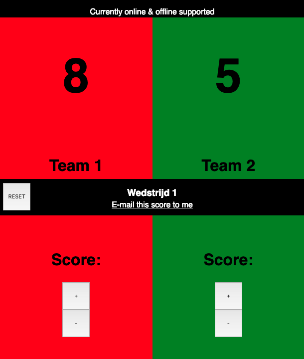
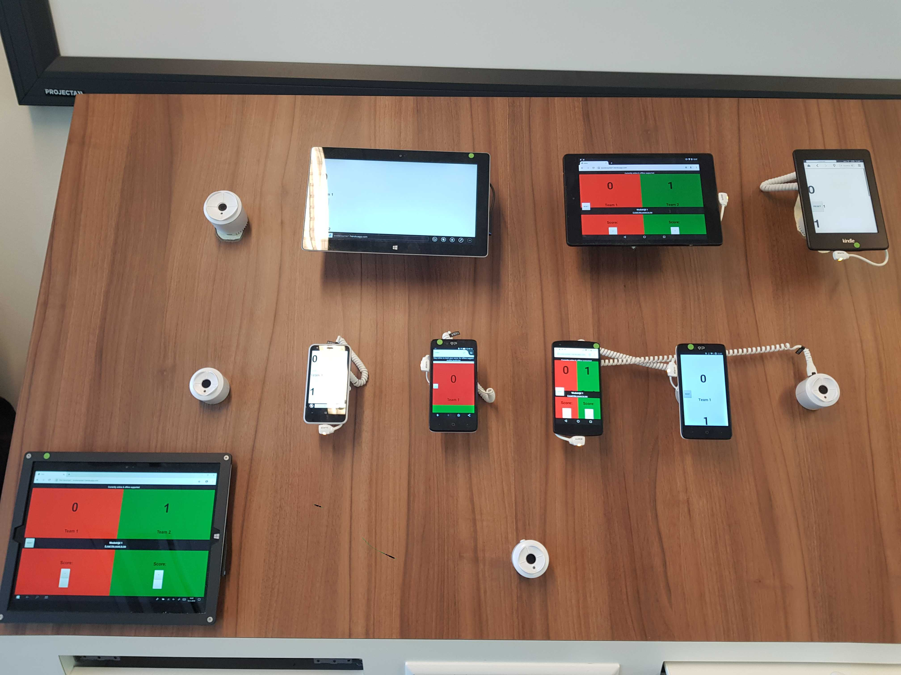

## Core functionality

This application allows a user to keep track of score, unhindered by the absence of internet and/or javascript.

## Install

`# Install dependencies`

`npm install`

`# Server`

`npm start`

## Elements

- server side code
- client side code
- html (ejs)
- css

## Device lab

Responsiveness is good, usable on every device. No colors on one older phone, but still usable, even on the e-reader because the app doesn't require javascript to work.

On smaller screens the 4 boxes of the grid are placed underneath each other, while on bigger screens all 4 boxes are in one screen.

Improvements that could be made based on this test:
- Investigate the old phone not loading the css
- Slightly bigger button for large screen touchscreen devices
- Numbers are the most important information on the page so those could be emphasized more on bigger screens

## Accesibility

Tabbing works like expected, ability to use arrow keys and w/d to change score quickly with the keyboard (only when javascript is enabled)

## Progressive enhancement

This application is not usable if the user had neither internet nor javascript enabled. The following combinations are possible:

### Internet and javascript

Application uses clientside javascript to control the score/reset buttons and the email link.

It does however update the score to the server so multiple devices can keep score and the score isn't lost on a page reload.

### No internet but javascript enabled

Application uses clientside javascript to control the score/reset buttons and the email link.

### No javascript but internet

Application uses serverside javascript to keep track of the score, reset the score and adjust the email link.

## Feature detection

The application checks for an internet connection, and updates accordingly. This means it doesn't matter if internet stops working halfway through the application (as long as javascript is enabled).

If javascript is disabled the application will fallback to serverside tracking.

Both internet and javascript can be enabled and disabled at any point in time while using the application.

The state of the internet connectivity is corresponded to the user.

### Fallback

Although ugly, the css theme uses color variables which have fallbacks in case these variable arent supported.

## features to be added:

- add teams to app
- team name, scoring, game name, game time, amount of games
- animation on score change client side
- localhost
- caching
